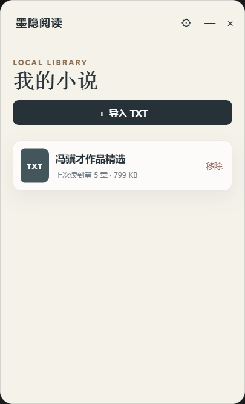

# 墨隐阅读（Moying Novels）

一款面向 Windows 与 macOS 的轻量级本地 TXT 小说阅读器。它把正文放在第一位，并提供透明阅读、自动滚动、鼠标移出自动隐藏等低干扰阅读能力。

[](https://github.com/zzf-yj/Moying-Novels)
[](https://github.com/zzf-yj/Moying-Novels)
[](https://www.electronjs.org/)
[](https://www.typescriptlang.org/)
[](./LICENSE)

## 界面预览

| 本地书架 | 沉浸阅读 |
| --- | --- |
|  |  |

| 阅读设置 | 透明阅读 |
| --- | --- |
|  |  |

## 主要功能

- 本地导入 TXT 小说，支持多文件选择。
- 支持 UTF-8、UTF-8 BOM、UTF-16 LE、GBK/GB18030 等常见中文文本编码。
- 自动识别常见中文章节、英文 `Chapter` 标题和数字章节标题。
- 自动保存当前章节和滚动位置，下次打开继续阅读。
- 自定义字号、行距、段落间距、背景色、文字色及透明度。
- 支持自动滚动，并可调节滚动速度。
- 窗口可自由移动、缩放、始终置顶，界面会根据窗口尺寸自适应。
- 正文默认铺满窗口；点击正文后才显示工具栏、章节控制和阅读进度。
- 可选择从 Windows 任务栏或 macOS Dock 隐藏，通过系统托盘或菜单栏恢复。

## 摸鱼模式

开启摸鱼模式后，鼠标移出阅读窗口约 130 毫秒，整个窗口会变为完全透明并开启鼠标穿透；鼠标回到原窗口区域时，正文和控制区会恢复显示。

摸鱼模式不会作为下次启动的默认状态保存，避免重新打开软件时找不到窗口。即使窗口已从任务栏或 Dock 隐藏，也可以通过系统托盘或 macOS 菜单栏恢复。

## 使用方法

1. 在书架点击“导入 TXT”。
2. 选择一本或多本本地小说。
3. 点击书籍进入阅读；点击正文显示或收起控制区。
4. 在“设置”中调整排版、透明度、自动滚动速度及窗口行为。
5. 需要隐藏阅读内容时，点击“开启摸鱼”。

阅读界面还支持 `Page Up` 和 `Page Down` 进行整页滚动。

## 本地开发

### 环境要求

- Node.js 20.19+ 或 22.12+
- npm 10 或更高版本
- Windows 10/11 或较新的 macOS

### 启动开发环境

```bash
git clone https://github.com/zzf-yj/Moying-Novels.git
cd Moying-Novels
npm install
npm run dev
```

### 检查与构建

```bash
# TypeScript 类型检查
npm run typecheck

# 自动化测试
npm test

# 构建主进程、预加载脚本和渲染页面
npm run build

# 生成当前平台的安装产物
npm run dist
```

Windows 构建产物位于 `release/`。macOS 的 DMG 和 ZIP 需要在 macOS 上构建；正式分发前还需要配置 Apple Developer ID 签名和公证。

如果本机安全软件导致 `electron-builder` 无法处理临时 Electron 目录，可以使用：

```bash
npm run dist:local
```

## 项目结构

```text
.
├─ electron/
│  ├─ main/          # Electron 主进程、数据存储、章节解析与摸鱼控制
│  └─ preload/       # 安全的渲染进程 API 桥接
├─ shared/           # 主进程与前端共享的 TypeScript 类型
├─ src/              # React 阅读器界面与响应式样式
├─ docs/images/      # README 界面截图
└─ package.json
```

## 数据与隐私

- 小说只从本地导入，不包含在线书源、账号系统或网络同步。
- 导入后的 UTF-8 副本、阅读进度和设置保存在应用数据目录中。
- Windows：`%APPDATA%\墨隐阅读`
- macOS：`~/Library/Application Support/墨隐阅读`
- 删除书架中的书籍时，也会删除应用保存的本地副本；原始 TXT 文件不会被修改。

## 技术栈

- Electron
- React
- TypeScript
- Vite / electron-vite
- electron-builder

## 当前限制

- 目前仅支持 TXT，不支持 EPUB、MOBI 或在线书源。
- 单个 TXT 文件最大支持 30 MB，避免超大文本造成异常内存占用。
- 章节识别基于常见标题规则，排版特殊的文本可能会被视为单章。
- macOS 发布包尚未配置代码签名与 Apple 公证。

## 参与开发

欢迎提交 Issue 或 Pull Request。提交前请至少运行：

```bash
npm run typecheck
npm test
npm run build
```

## License

[MIT](./LICENSE)
